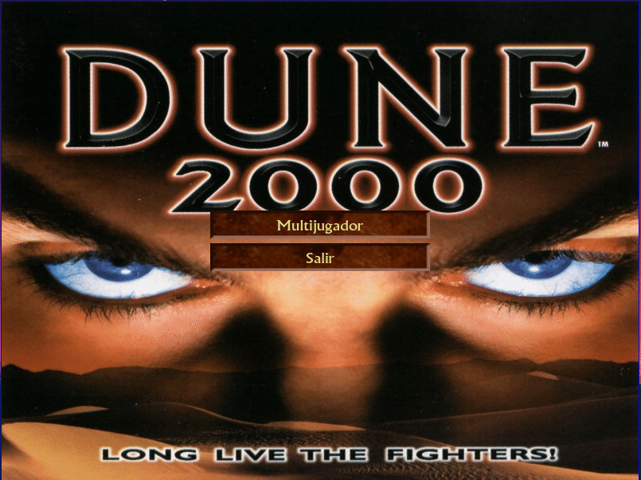
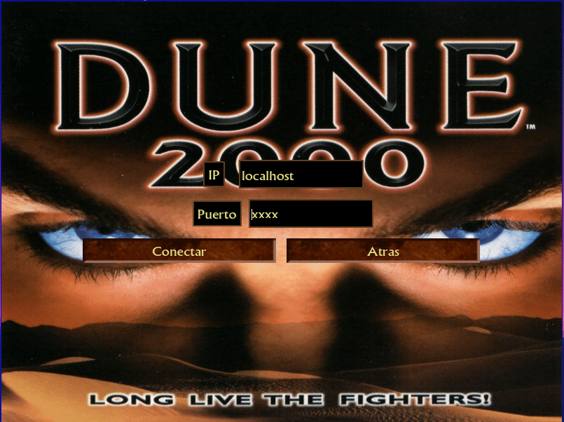
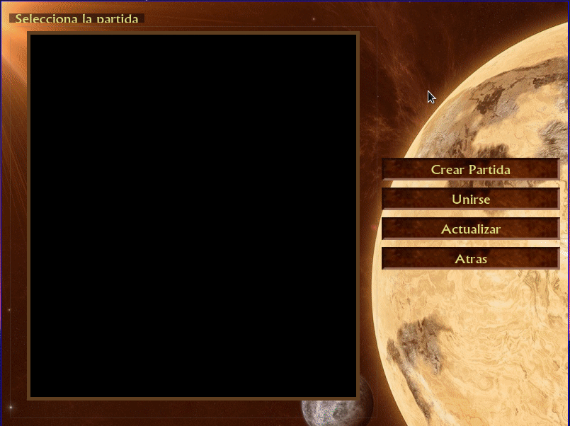
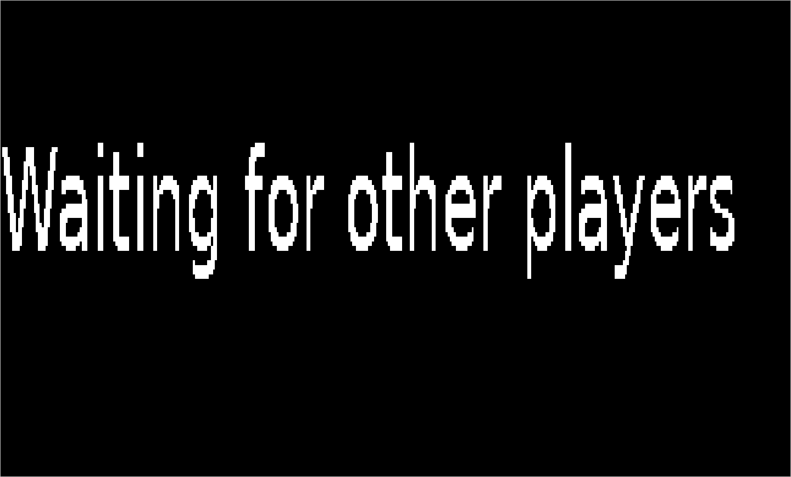
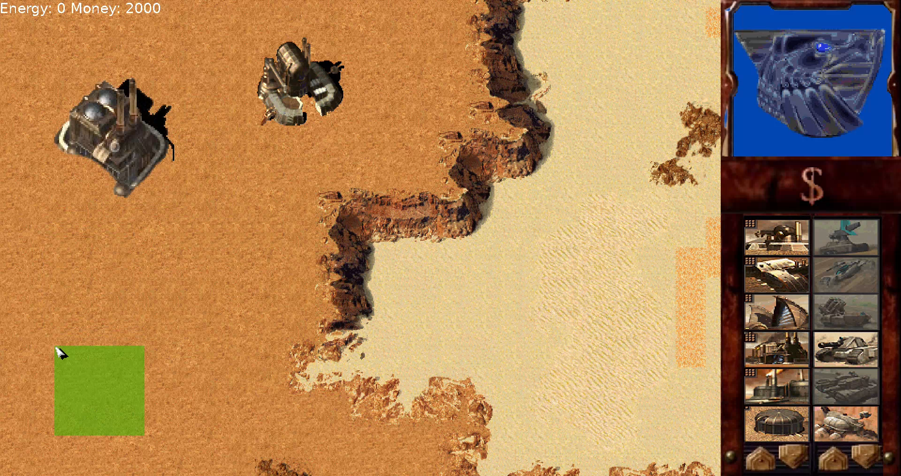
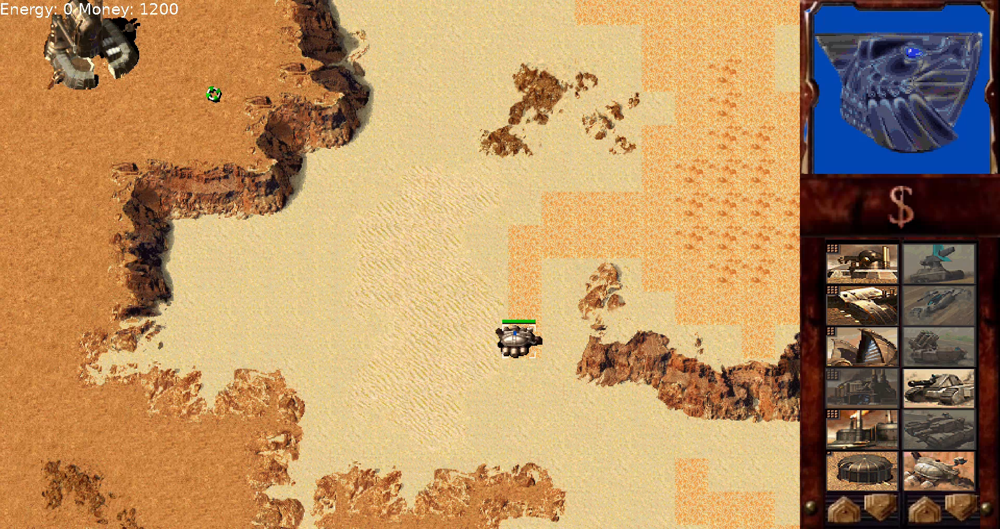
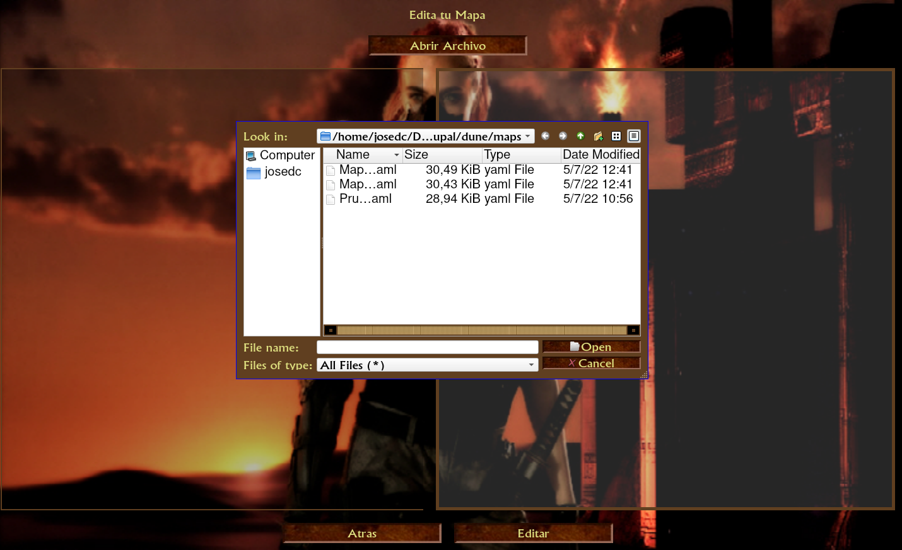
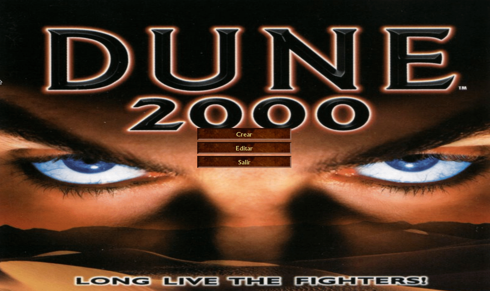

# Dune 2000

[![Build Status][travis-badge]][travis-link]

[travis-badge]:    https://app.travis-ci.com/hhuzan/dune.svg?token=jcG6bmaHoQz9k4mjZ2nA&branch=main

[travis-link]:     https://travis-ci.com/hhuzan/dune


# Taller de programacion I - Catedra Veiga - FIUBA

# Trabajo Práctico Final

| Padrón | Alumnos                 |
|--------|-------------------------|
| 100113 | Burgos, Juan Sebastian  |
|  96467 | Chávez Cabanillas, José |
| 102174 | Del Pup, Tómas          |
|  67910 | Huzan, Hugo             |

# Tabla de Contenidos

- [Guía de Instalación](#guia-de-instalación)
    - [Requisitos](#requisitos)
    - [Instalación de Dependencias](#instalación-de-dependecias)
    - [Configuración e instalación](#configuración-e-instalación)
    - [Desinstalación](#desinstalación)
- [Guía de Usuario](#guía-de-usuario)
    - [Formas de ejecución](#formas-de-ejecucción)
        - [Server](#server)
        - [Cliente](#cliente)
        - [Editor](#editor)
    - [Como jugar](#cómo-jugar)
        - [Crear Partida](#crear-partida)
        - [Unirse a Partida](#unirse-a-partida)
    - [Juego](#flujo-de-juego)

    - [Editor](#editor-de-mapas)
        - [Crear Mapa](#crear)
        - [Editar Mapa](#editar)

# Guía de instalación

## Requisitos

Uno de los requisitos más importantes que utiliza el juego es el sistema operativo sobre el cual se ejecuta, para lo cual se debera contar con alguna distribucion que utilice GNU/Linux como sistema operativo.

Además se debe contar tanto con git, CMake y Make, para la descarga del juego así como para la compilación del juego.

## Instalación de Dependecias

Los paquetes que usa el juego para ejecutarse, son SDL, Qt5 y YAML-cpp, dependiendo del gestor de paquetes del sistema operativo que se use, los paquetes a instalar son los mismos.

### Ubuntu: 

```
    sudo apt-get update
    sudo apt-get install git cmake make libsdl2-dev libsdl2-image-dev libsdl2-ttf-dev qt5-default qtmultimedia5-dev libqt5multimedia5-plugins libyaml-cpp-dev libsdl2-mixer-dev
```

## Configuración e Instalación

Como primer paso se debe clonar este repositorio con el siguiente comando:
```
    git clone https://github.com/juansburgos/Dune-2000.git  
```
Después de eso se debe ingresar a la carpeta donde se clonó el repositorio, donde se tienen dos opciones de instalacion.

* CMake - Make: construye el proyecto sin instalarlo, para eso simplemente se deben ejecutar los siguientes comandos, dentro de la carpeta:

```
    mkdir build
    cd build
    cmake ..
    make
```

 * Script: instala el juego en la carpeta /usr/local/share/, y crea acceso directos desde la consola, para lo cual basta con ejecutar el script:

```
    sudo bash install.sh
```

## Desinstalación

Esta opción es válida si se instaló el juego mediante el script. Para realizar la desinstalación del juego, simplemente se debe ejecutar el siguiente script:

```
    sudo bash unistall.sh
```

# Guía de Usuario

## Formas de ejecucción

### Server

Dependiendo de la forma de instalacion hay dos formas de ejecutar el servidor del juego. Es necesario en cada una de las formas indicar el puerto por el cual el servidor va a funcionar

La primera es localizarse dentro de la carpeta build, y ejecutar por consola el siguiente comando:

```
    ./dune_server [PORT]
```

En caso de haber elegido la opción de instalación por script, simplemente desde la terminal ejecutar el comando:

```
    dune_server [PORT]
```

### Cliente

Dependiendo de la forma de instalacion hay dos formas de ejecutar el servidor del juego.
La primera es localizarse dentro de la carpeta build, y ejecutar por consola el siguiente comando:

```
    ./dune_client
```

En caso de haber elegido la opción de instalación por script, simplemente desde la terminal ejecutar el comando:

```
    dune_client
```

### Editor

Dependiendo de la forma de instalacion hay dos formas de ejecutar el servidor del juego. 
La primera es localizarse dentro de la carpeta build, y ejecutar por consola el siguiente comando:

```
    ./editor
```

En caso de haber elegido la opción de instalación por script, simplemente desde la terminal ejecutar el comando:

```
    dune_editor
```

## Cómo Jugar

El único modo de juego es multijugador, por lo cual se requiere que el servidor este funcionando activamente.

Al ejecutar el cliente, se encuentra la pantalla de inicio en la cual deberá dirigirse a Multijugador, para hacer la respectiva conexión con el servidor. Por defecto se establecieron la IP y el puerto.



En caso de no realizare la conexión a la IP o al puerto, se mostrará un mensaje de error.



Una vez hecho esto, se pasara a la sala de Multijugador, donde se verán en caso de haberlas, las partidas que se encuentren activas en el servidor, así como también las opciones de Crear, Unirse y Actualizar la lista de partidas.


### Crear Partida

Para crear partida desde el menu de Multijugador, presionar el boton de Crear Partida, dentro de este menú, se tiene que escribir un nombre de la partida, seleccionar un mapa y la casa con la que se quiere jugar.



En caso de que no se pueda crear partida por algún motivo se mostrará un mensaje de error.

### Unirse a Partida

Para unirse a una partida, simplemente se debe seleccionar dentro de la lista de partidas una de ellas y dar al botón de unirse, dentro de este menú, se debe seleccionar la casa con la que se desea jugar.


## Flujo de Juego

Al crear una partida, se pasará a una pantalla de espera, hasta que la cantidad de jugadores requeridos para la partida se conecten.



Una vez conectados los jugadores requeridos, se comenzará con el juego en si.

Una de las funciones principales del juego es la de construir edificios, para ello simplemente se debe seleccionar el edificio principal, esperar a que el icono se marque en verde, para después seleccionar la construcción, y ubicarla sobre el terreno, si el edificio se puede construir sobre ese terreno, se mostrara una zona de color verde, en caso contrario mostrará rojo la zona donde no se pueda construir.


Si se selecciona una unidad el cursor del juego cambiará, para poder seleccionarse desplazarse a un lugar o atacar a una unidad 


El juego terminará cuando la casa inicial sea destruida.

## Editor de Mapas

El editor cuenta con las funciones de creación y edición de un mapa, todos los mapas creados generan un archivo YAML, con un determinado formato

### Crear

Para crear una mapa basta con ir a la sección de crear, dentro del cual, se de ingresar el nombre del mapa a crear, el tamaño del mapa (todos los mapas creados son de igual lado), al ingresar ese valor el mapa a crear tiene un tamaño en pixeles (``tamaño*32px``). Por ejemplo si se ingresa 64, el tamaño del mapa es de ``64*32px=2048px``.

Por defecto el mapa es creado sobre un terreno de arena, para dibujar sobre ello, se debe borrar la posicion a dibujar, y después ingresar el tile del mapa.

Se cuenta además con dos elementos dentro de la lista de tiles que son: 

    - Estrella: señala el punto de inicio del jugador, también representa la cantidad de jugadores que pueden jugar por mapa.
    - Punto Rojo: representa la posición de spawn del gusano, esta puede ser una o varias, posiciones


### Editar

Para editar un mapa, se tiene que ir a la función de editar y bastará con abrir un mapa con formato YAML, por defecto se abre en la carpeta de mapas del juego, donde se encuentran algunos mapas funcionales para el juego.



Al igual que la opción de crear, se repite la misma mecánica para el dibujo de mapas.



